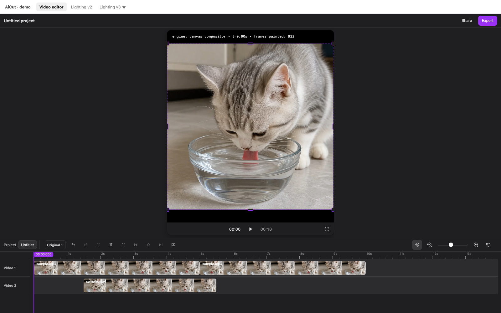
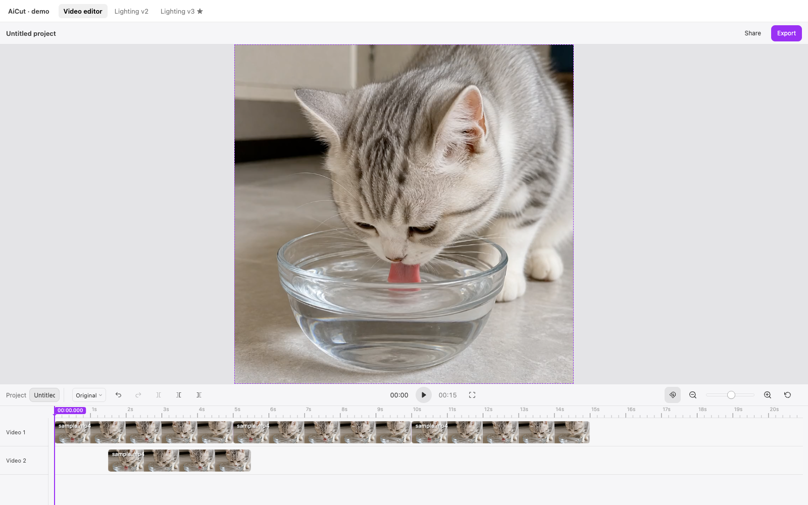
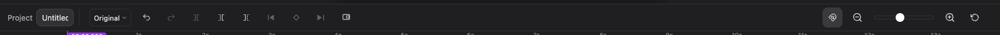
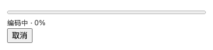
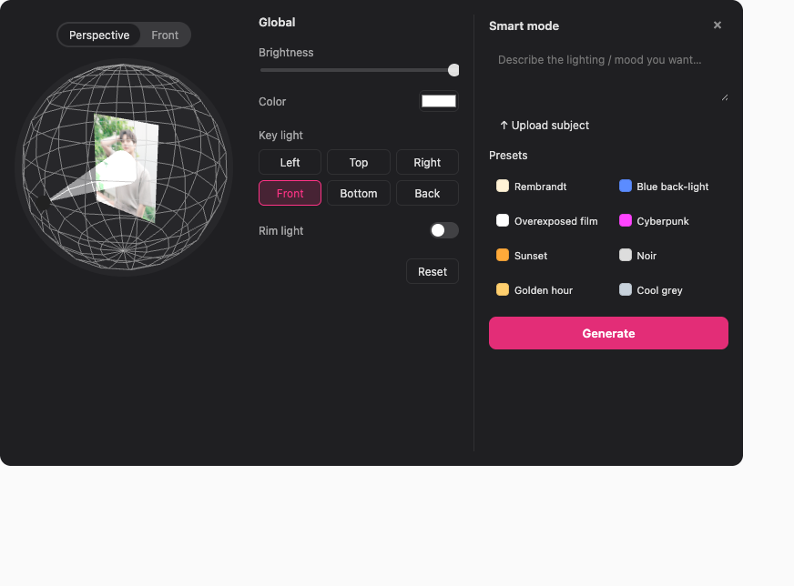
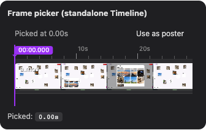

<div align="center">

# 🎬 AiCut

### Drop-in video editor + 3D lighting picker for **React** and **Vue**
Canvas-rendered timeline · plain JSON projects · real mp4 export · opt-in three.js lighting

<br />

[](https://www.npmjs.com/package/@aicut/core)
[](https://www.npmjs.com/package/@aicut/react)
[](https://www.npmjs.com/package/@aicut/vue)
[](./LICENSE)
[](https://github.com/ziqiangai/AiCut/stargazers)



</div>

---

## ✨ Why AiCut

Most "video editor in the browser" projects are either a finished SaaS (you can't embed them) or a single demo file you'd have to fork to ship. **AiCut is a publishable component library.** One framework-agnostic engine, thin React and Vue shells, JSON projects so your host app owns the data.

<table>
  <tr>
    <td>🧠</td><td><b>One engine, multiple frontends</b><br/><code>@aicut/core</code> does all the work; the React / Vue wrappers are &lt;100&nbsp;LOC shells. Same shape as ag-Grid.</td>
  </tr>
  <tr>
    <td>🚀</td><td><b>Canvas timeline, zero DOM clip nodes</b><br/>Hundreds of clips render in &lt;2&nbsp;ms; smooth pan, zoom, drag-snap, edge auto-scroll.</td>
  </tr>
  <tr>
    <td>📦</td><td><b>Plain JSON projects</b><br/>Millisecond timing, no framework or runtime coupling. Save to your DB, diff in git, ship to a backend.</td>
  </tr>
  <tr>
    <td>🎨</td><td><b>First-class theming + i18n</b><br/>CSS variables for chrome + letterbox; English default with bundled <code>zh</code> pack, host-overridable per-key.</td>
  </tr>
  <tr>
    <td>🛰️</td><td><b>BYO export backend with progress</b><br/>Reference <b>Fastify</b> (TypeScript) and <b>net/http</b> (Go) services with real-time <b>SSE progress</b> over ffmpeg.</td>
  </tr>
  <tr>
    <td>🧩</td><td><b>Custom toolbar slots</b><br/>Bookend <code>toolbarLeft</code> / <code>toolbarRight</code> on both the editor and the standalone <code>&lt;Timeline&gt;</code>. The library renders nothing into them.</td>
  </tr>
  <tr>
    <td>💡</td><td><b>Opt-in 3D lighting picker</b><br/>A separate <code>@aicut/core/lighting</code> entry powers an interactive sphere-and-image lighting director with perspective / front views, drag-snap directions, and a host-supplied AI smart panel. Three.js is bundled only on this sub-entry — the video-editor bundle stays small.</td>
  </tr>
</table>

---

## 🚀 Quick start (React)

```bash
pnpm add @aicut/react @aicut/core
```

```tsx
import { useRef } from "react";
import {
  VideoEditor,
  type VideoEditorApi,
  type Project,
} from "@aicut/react";
import "@aicut/core/styles.css";

const project: Project = {
  version: 1,
  sources: [
    { id: "src-1", url: "/media/clip-a.mp4", kind: "video", name: "A" },
  ],
  tracks: [
    { id: "tr-1", kind: "video", clips: [
      { id: "cl-1", sourceId: "src-1", in: 0, out: 8000, start: 0 },
    ]},
  ],
};

export function MyApp() {
  const apiRef = useRef<VideoEditorApi | null>(null);
  return (
    <VideoEditor
      apiRef={apiRef}
      defaultProject={project}
      onChange={(p) => console.log("autosave", p)}
      onExport={(p) =>
        fetch("/export", { method: "POST", body: JSON.stringify({ project: p }) })
      }
      style={{ height: 600 }}
    />
  );
}
```

The `apiRef` exposes imperative methods (`split`, `seek`, `setProject`, `requestExport`, …) for keyboard shortcuts or external controls.

### 🟢 Vue 3

```bash
pnpm add @aicut/vue @aicut/core
```

```vue
<script setup lang="ts">
import { ref } from "vue";
import { VideoEditor, type EditorApi, type Project } from "@aicut/vue";
import "@aicut/core/styles.css";

const editor = ref<{ api(): EditorApi | null } | null>(null);
const project: Project = { /* same shape */ };
</script>

<template>
  <VideoEditor
    ref="editor"
    :default-project="project"
    @change="(p) => console.log('autosave', p)"
    @export="onExport"
  />
</template>
```

### 🟡 Vanilla JS

```ts
import { Editor } from "@aicut/core";
import "@aicut/core/styles.css";

const editor = Editor.create({
  container: document.getElementById("app")!,
  project: { /* … */ },
});

editor.on("change", ({ project }) => console.log("autosave", project));
```

---

## 🎨 Theming

Two CSS-variable swaps and you have a totally different look. Defaults to a pro-NLE charcoal; pass `theme={...}` to switch.

<div align="center">

| Dark (default) | Light |
| :-: | :-: |
|  |  |

</div>

```tsx
<VideoEditor
  theme={{
    controlsBg: "#f6f6f8",
    controlsText: "rgba(0, 0, 0, 0.78)",
    controlsBorder: "rgba(0, 0, 0, 0.08)",
    controlsHover: "rgba(0, 0, 0, 0.06)",
    controlsActive: "rgba(0, 0, 0, 0.08)",
    previewBg: "#e4e4e7",                 // letterbox colour
  }}
/>
```

Every variable is also writeable as plain CSS — `.aicut-root { --aicut-controls-bg: ...; }` works just as well if you'd rather keep theming out of JS.

---

## 🌐 Internationalisation

English by default. The bundled `localeZh` covers the editor end-to-end (toolbar tooltips, canvas track headers, exit-fullscreen overlay). Hosts can override any subset of keys, and runtime switching is supported.

```tsx
import { VideoEditor, localeZh } from "@aicut/react";

// Whole-locale swap
<VideoEditor locale={localeZh} />

// Partial override
<VideoEditor locale={{ undo: "Annuler", redo: "Refaire" }} />
```

Switching at runtime is a regular prop change — the toolbar re-titles and the timeline canvas re-paints in place.

---

## 🧩 Custom toolbar slots

The editor's top toolbar reserves bookend slots (`toolbarLeft`, `toolbarRight`) for host-supplied controls — aspect ratios, export buttons, branding, AI badges, anything. The library paints nothing into them and renders no separator until they're populated.



```tsx
<VideoEditor
  toolbarLeft={
    <select value={aspect} onChange={(e) => setAspect(e.target.value)}>
      <option value="16:9">16:9</option>
      <option value="9:16">9:16</option>
      <option value="1:1">1:1</option>
    </select>
  }
  toolbarRight={
    <button onClick={() => apiRef.current?.requestExport()}>Export</button>
  }
/>
```

The same prop shape exists on the standalone `<Timeline>` — pass `toolbar` plus your slot content.

---

## 🛰️ Export backends + live progress

The editor never calls a backend on its own. `onExport` hands the host a JSON `Project`; from there your app POSTs it wherever. We ship two **reference backends** that produce a real mp4 via ffmpeg:

| Backend | Stack | Port |
| :--- | :--- | :--- |
| [`backends/ts`](./backends/ts) | TypeScript + Fastify | 8787 |
| [`backends/go`](./backends/go) | Go + net/http | 8788 |

Both implement the same wire contract:

```
POST /export                                    Content-Type: application/json
  body: { project: Project, output?: { width, height, fps } }
→ Content-Type: text/event-stream
  data: {"phase":"encode","overall":0.42,"clipIndex":0,"totalClips":3}
  data: {"phase":"concat","overall":0.99,"totalClips":3}
  data: {"phase":"done","fileUrl":"/files/<uuid>.mp4","id":"<uuid>"}

GET  /files/<uuid>.mp4                          → video/mp4
```

`out_time_us` from ffmpeg's `-progress` stream is aggregated across the per-clip encode passes, so the overall fraction is honest end-to-end. Aborting the client connection (or AbortController on the fetch) kills the in-flight ffmpeg.

<div align="center">



</div>

The demo's React-side parser + UI lives in [`examples/react-demo/src/App.tsx`](./examples/react-demo/src/App.tsx).

### Bringing your own ffmpeg

Each backend resolves an ffmpeg binary in this order:

1. `AICUT_FFMPEG` env var (`/abs/path/to/ffmpeg`)
2. `./ffmpeg-bin/ffmpeg` next to the backend
3. System `ffmpeg` on `$PATH`

---

## 💡 Lighting picker (opt-in)

An independent 3D component for AI-relighting workflows. The picker shows the host-picked frame on a flat plane inside a wireframe sphere; the user drags a light dot around the surface to set direction. Brightness drives the cone-beam length; color tints the beam.

Three.js powers the scene and ships only on the **`@aicut/core/lighting`** sub-entry — consumers of the video editor pay nothing for it.

<div align="center">



</div>

The library renders **just the picker** (scene + controls). Smart-mode prompt, preset thumbnails, Generate button, close behaviour — all host code, laid out alongside `<LightingEditor>` in your own flex/grid:

```tsx
import { useRef, useState } from "react";
import { LightingEditor, type LightingEditorApi } from "@aicut/react/lighting";
import "@aicut/core/styles.css";

function Relight() {
  const apiRef = useRef<LightingEditorApi | null>(null);
  const [smartOpen, setSmartOpen] = useState(true);

  const onGenerate = (): void => {
    const cfg = apiRef.current?.getConfig();
    if (cfg) fetch("/relight", { method: "POST", body: JSON.stringify(cfg) });
  };

  return (
    <div style={{ display: "flex", gap: 16 }}>
      <LightingEditor
        apiRef={apiRef}
        subjectImageUrl="/frames/subject.jpg"
        onChange={(cfg) => console.log(cfg)}
        // Buttons rendered inside the controls column's footer slot
        // — the only place the library leaves room for host actions.
        controlsFooter={
          <button onClick={() => apiRef.current?.reset()}>Reset</button>
        }
      />
      {smartOpen && (
        <aside>
          <button onClick={() => setSmartOpen(false)}>×</button>
          <textarea placeholder="Describe the lighting…" />
          <button onClick={onGenerate}>Generate</button>
        </aside>
      )}
    </div>
  );
}
```

The full `LightingConfig` (brightness, color, key-direction unit vector, key preset, rim toggle) is plain JSON — same philosophy as the video editor's project.

---

## 🎯 Standalone Timeline (frame picker)

The `<Timeline>` component works without the rest of the editor — useful for a frame-picker, a thumbnail strip, or a read-only preview.

<div align="center">



</div>

```tsx
import { Timeline } from "@aicut/react";

<Timeline
  defaultProject={{ /* single clip */ }}
  showHeader={false}
  readOnly
  toolbar
  toolbarLeft={<span>Picked at {pickedMs / 1000}s</span>}
  onSeek={(ms) => setPickedMs(ms)}
/>
```

---

## 📐 Architecture

```
packages/
  core/           @aicut/core    framework-agnostic engine
                                  ├─ Editor + Project + EventBus
                                  ├─ HTML5 PlaybackEngine
                                  ├─ Canvas Timeline (ruler, tracks, clips,
                                  │   thumbnails, playhead, snap, scrollbars)
                                  └─ Theme + i18n (en / zh)
  react/          @aicut/react   thin React shell, portal-based slots
  vue/            @aicut/vue     thin Vue 3 shell, slot watchers
examples/
  react-demo/     Vite playground covering every public surface
e2e/              Playwright (system Chrome, --no-proxy-server)
backends/
  ts/             Fastify SSE export service
  go/             net/http SSE export service
docs/
  screenshots/    README assets, regenerated by the screenshots spec
```

Library packages (`packages/*`) publish to npm. Everything else exists to exercise and validate them.

---

## 🛠 Development

```bash
pnpm install                       # workspace install
pnpm build                         # build core / react / vue
pnpm demo:react                    # http://127.0.0.1:5173

# Backends
cd backends/ts && pnpm dev         # http://127.0.0.1:8787
cd backends/go && go run .         # http://127.0.0.1:8788

# Tests
pnpm typecheck                     # whole workspace, strict TS
pnpm test:e2e                      # Playwright against the live demo
pnpm --filter @aicut/e2e exec playwright test screenshots.spec.ts
                                   # regenerate docs/screenshots/*.png
```

### Release

```bash
# Bump versions in packages/*/package.json then:
NPM_TOKEN=npm_xxx ./scripts/publish.sh
# Or with 2FA:
NPM_TOKEN=npm_xxx ./scripts/publish.sh --otp 123456
```

The script is idempotent — already-published versions are skipped, so a re-run after a network blip only ships what's missing. Tags `v<core-version>` on full success.

---

## 🗺 Roadmap

- [x] Multi-track timeline with drag / trim / split / snap
- [x] In-canvas scrollbars + edge auto-scroll while dragging
- [x] Top-toolbar slots for host-supplied controls
- [x] SSE-progress export backends (TS + Go)
- [x] Bundled `en` / `zh` locale packs + runtime switch
- [x] 3D lighting picker (`@aicut/core/lighting` sub-entry)
- [ ] Speed adjustment (timeline already reserves the slot)
- [ ] Audio track rendering + waveform thumbnails
- [ ] WebGL preview engine for frame-accurate seek + transitions
- [ ] Lighting → relighting backend reference
- [ ] Hosted demo site

---

## 🧑‍💻 Tech stack

<p>
  
  
  
  
  
  
  
  
  
  
  
</p>

---

<div align="center">

**[npm — @aicut/core](https://www.npmjs.com/package/@aicut/core)** ·
**[@aicut/react](https://www.npmjs.com/package/@aicut/react)** ·
**[@aicut/vue](https://www.npmjs.com/package/@aicut/vue)** ·
**[Issues](https://github.com/ziqiangai/AiCut/issues)**

Made with ❤️ for browser-based video editing · MIT License

</div>
